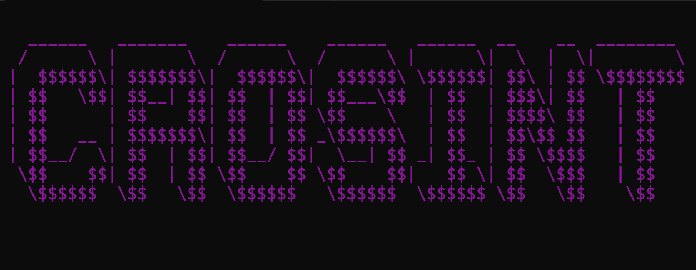

<h1 align="center">CROSINT</h1>

  

    
    
    
    
  

  
  <i>Open Source Intelligence Gathering Tool</i>
   </img>

  
  
  

### Categories
  - [Introduction](#introduction)
  - [Categories](#categories)
    - [Phone Records 📕](#phone-records-)
    - [Phone Carrier 📲](#phone-carrier-)
    - [Breach Data 🤖](#breach-data-)
  - [Packages](#packages)

## Introduction
CROSINT is an **Open Source Intelligence Gathering Tool (OSINT)** to search digital footprints of specific objects. I, myself,
have used many tools including Sherlock and Google Dorking to utilize intelligence gathering for *educational* and *authorized*
purposes. Utilizing my experience with python and related languages I wanted to to create a __CLI Tool__ available on Ubuntu and Windows systems to explore digital investigations.

## Categories

#### Phone Records 📕

> [!WARNING]
> You are responsible with your own actions with what you use with this tool. CROSINT is to be used for educational purposes only.

## License

